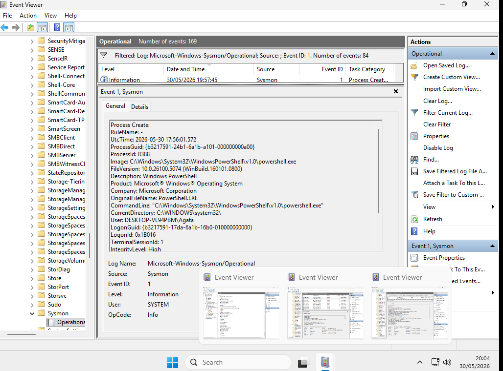

# PowerShell Execution Detection Using Sysmon

## Objective

Detect PowerShell execution activity using Sysmon telemetry and investigate process creation events associated with scripting activity.

## Event Information

| Field | Value |
|---------|---------|
| Event ID | 1 |
| Event Type | Process Creation |
| User | Agata |
| Process | powershell.exe |

## Investigation

Sysmon generated an Event ID 1 (Process Create) after PowerShell was launched on the endpoint.

The following process was observed:

```text
C:\Windows\System32\WindowsPowerShell\v1.0\powershell.exe
```

The event captured:

- Process Path
- Command Line
- User Context
- Process ID
- Logon Session
- SHA256 Hash

This information is valuable during threat hunting and incident response investigations.

## Evidence



## Security Relevance

PowerShell is frequently abused by threat actors for:

- Malware Execution
- Script-Based Attacks
- Download Cradles
- Credential Theft
- Lateral Movement
- Living-off-the-Land Techniques

## MITRE ATT&CK

- T1059.001 – PowerShell

## Skills Demonstrated

- Sysmon Monitoring
- Process Analysis
- Windows Logging
- Threat Hunting
- Endpoint Investigation
