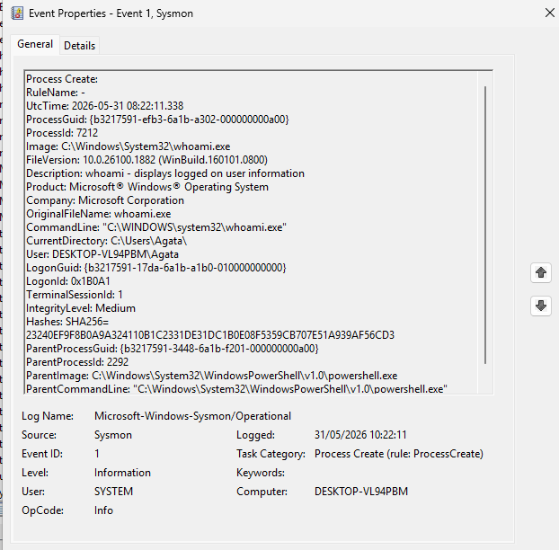

# Process Tree Investigation Using Sysmon

## Objective

Investigate parent-child process relationships using Sysmon telemetry.

## Observed Process Tree

cmd.exe
└── powershell.exe
    └── whoami.exe

## Event Information

| Process | Parent Process |
|----------|----------|
| powershell.exe | cmd.exe |
| whoami.exe | powershell.exe |

## Analysis

Sysmon recorded a process execution chain beginning with Command Prompt, followed by PowerShell, which then launched whoami.exe.

This parent-child relationship is commonly analyzed during incident response and threat hunting activities.

## Evidence

## Security Relevance

Process tree analysis helps identify:

- Suspicious process chains
- Malware execution
- Living-off-the-Land techniques
- PowerShell abuse

## MITRE ATT&CK

- T1059 – Command and Scripting Interpreter
- T1059.001 – PowerShell
- T1033 – System Owner/User Discovery

## Skills Demonstrated

- Sysmon Analysis
- Process Tree Analysis
- Threat Hunting
- Windows Event Investigation
