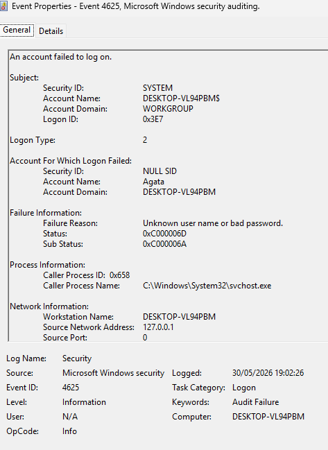

# Detecting Failed Logons with Sigma

## Objective

Create a Sigma rule to detect failed Windows logon attempts.

## Sigma Rule

```yaml
title: Failed Windows Logon
id: failed-logon-detection
status: experimental
logsource:
  product: windows
  service: security

detection:
  selection:
    EventID: 4625
  condition: selection

level: medium
```
## Evidence

### Windows Event ID 4625



### Sigma Detection Rule

The Sigma rule below detects Event ID 4625 events from Windows Security logs.

---

## Analysis

This Sigma rule detects Windows Security Event ID 4625, which indicates a failed authentication attempt.

## Security Relevance

Monitoring failed logons helps identify:

* Brute Force Attacks
* Password Spraying
* Unauthorized Access Attempts

## MITRE ATT&CK

* T1110 - Brute Force

## Skills Demonstrated

* Sigma Rules
* Detection Engineering
* Windows Security Logs
* Threat Detection
