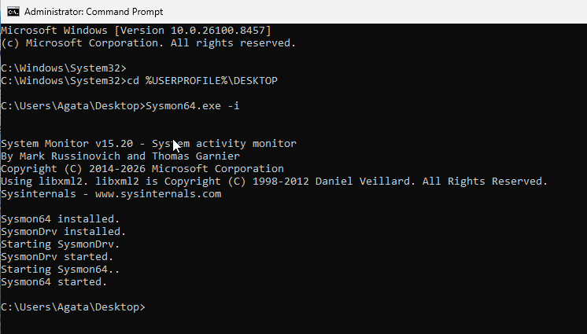

## Evidence

# Sysmon Installation Verification

## Objective

Verify successful Sysmon installation and configuration.

## Event Information

- Event ID: 16
- Source: Sysmon
- Event Type: Configuration Change

## Analysis

Sysmon successfully installed and initialized monitoring on the endpoint.

The event confirms:

- Sysmon service activation
- Configuration loading
- Endpoint monitoring readiness

## Evidence

## Security Relevance

Sysmon enhances Windows logging by providing visibility into:

- Process Creation
- Network Connections
- Driver Loads
- Registry Activity

## Skills Demonstrated

- Sysmon Deployment
- Windows Event Viewer
- Endpoint Monitoring
- Security Log Analysis
