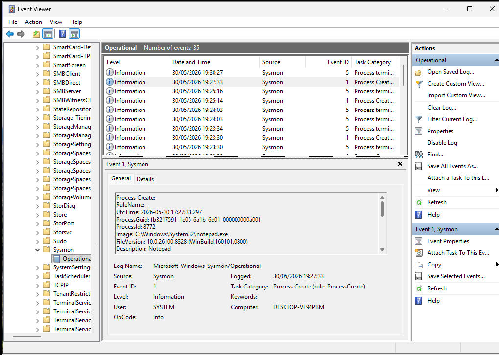
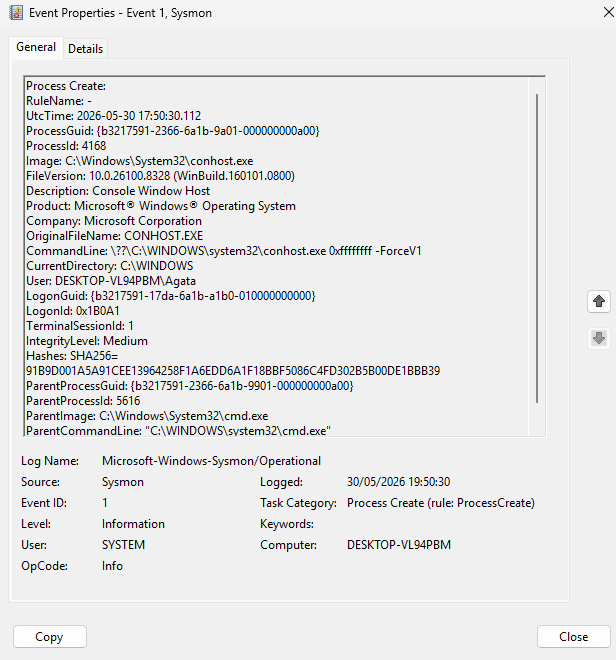

# Sysmon Process Creation Monitoring

## Objective

Monitor process creation events using Sysmon and analyze parent-child process relationships.

## Event Information

| Field | Value |
|---------|---------|
| Event ID | 1 |
| Event Type | Process Creation |
| User | Agata |
| Process | conhost.exe |
| Parent Process | cmd.exe |

## Investigation

A Sysmon Event ID 1 (Process Create) was generated after launching a process from the Windows command line.

The event recorded:

- Process Name
- Parent Process
- Process ID
- User Context
- Command Line
- SHA256 Hash

Observed relationship:

```text
cmd.exe
└── conhost.exe
```

This parent-child relationship is commonly observed when commands are executed through the Windows command prompt.

## Evidence





## Security Relevance

Process creation monitoring is essential for detecting:

- Malware execution
- Suspicious command execution
- PowerShell abuse
- Living-off-the-Land techniques (LOLBins)
- Lateral movement activity

## MITRE ATT&CK

- T1059 – Command and Scripting Interpreter

## Skills Demonstrated

- Sysmon Configuration
- Windows Event Analysis
- Process Monitoring
- Threat Hunting
- Endpoint Investigation
