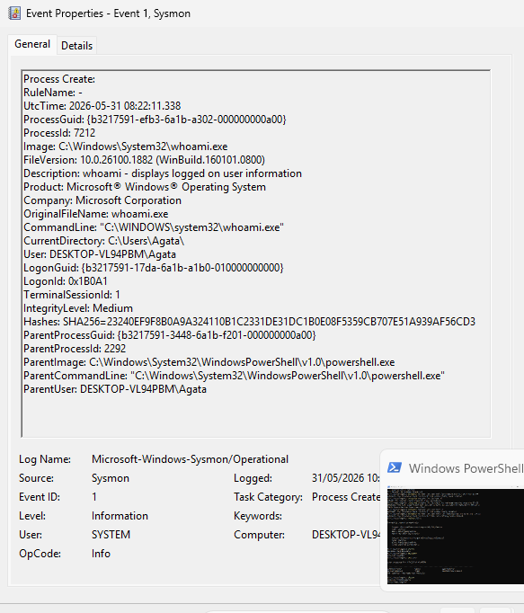

# User Discovery Detection Using Sysmon

## Objective

Detect user discovery activity using Sysmon process creation events.

## Event Information

### Event ID 1

Process Creation Event

### Observed Process

- whoami.exe

## Evidence

Sysmon recorded the execution of:

C:\Windows\System32\whoami.exe

Parent Process:

powershell.exe

## Analysis

The whoami command was executed from PowerShell.

The command was used to identify the currently logged-on user.

Sysmon captured:

- Process Name
- Command Line
- User Context
- Parent Process
- Process ID
- SHA256 Hash

## Security Relevance

User discovery activity is commonly observed during attacker reconnaissance.

Threat actors often use whoami to:

- Identify the current user
- Verify privileges
- Understand host context

## MITRE ATT&CK

- T1033 – System Owner/User Discovery

## Skills Demonstrated

- Sysmon
- Windows Monitoring
- Threat Hunting
- Process Analysis
- MITRE ATT&CK Mapping
