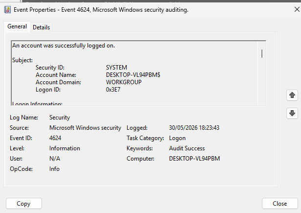

# Windows Event Investigation

## Objective

Investigate Windows Security Log events related to successful and failed authentication attempts.

---

# Event ID 4624 – Successful Logon

## Description

A successful user authentication event was identified in the Windows Security log.

## Event Information

| Field | Value |
|---------|---------|
| Event ID | 4624 |
| Category | Logon |
| Result | Audit Success |

## Investigation

The event confirms that a user successfully authenticated to the local system.

Successful logon events are important for establishing normal user activity and identifying potential unauthorized access.

## Evidence

## Security Relevance

Monitoring successful logons helps analysts:

- Track user activity
- Identify unusual logon patterns
- Detect account compromise
- Investigate lateral movement

## MITRE ATT&CK

- T1078 – Valid Accounts

## Skills Demonstrated

- Windows Event Viewer
- Security Log Analysis
- Authentication Monitoring
- Incident Investigation

---

# Event ID 4625 – Failed Logon

## Description

A failed authentication attempt was detected in the Windows Security log.

## Event Information

| Field | Value |
|---------|---------|
| Event ID | 4625 |
| Category | Logon |
| Result | Audit Failure |
| Account Name | Agata |
| Logon Type | 2 (Interactive Logon) |

## Investigation

The investigation identified an unsuccessful logon attempt caused by an incorrect password.

The event recorded:

- User Account: Agata
- Logon Type: Interactive
- Source Address: 127.0.0.1
- Failure Reason: Unknown user name or bad password

## Findings

| Field | Value |
|---------|---------|
| Status | 0xC000006D |
| Sub Status | 0xC000006A |
| Meaning | Incorrect Password |

## Evidence

## Security Relevance

Failed logon events are commonly monitored to detect:

- Brute Force Attacks
- Password Spraying
- Unauthorized Access Attempts
- Credential Abuse

## MITRE ATT&CK

- T1110 – Brute Force

## Skills Demonstrated

- Event Viewer Analysis
- Authentication Monitoring
- Windows Security Logs
- Threat Detection
